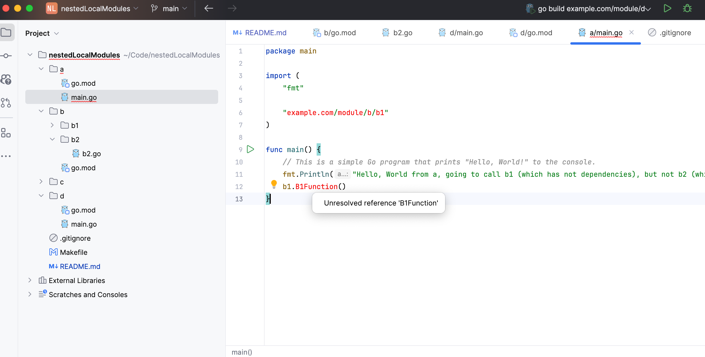
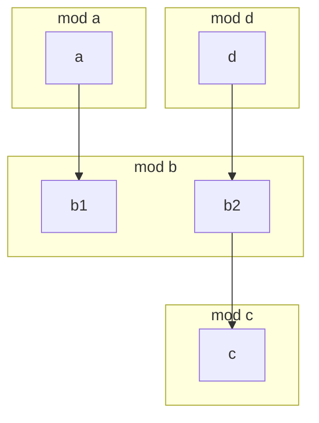

## Description

module "a" does not need module "c" to run, because package a does
not import it. 

go is able to build package a without having to download (or replace locally) module c.

But Goland is confused, it is able to run the package a, but IDE is lost and is displaying errors everywhere in module a :



## Little investigation

Goland seem to be using the following command to check the dependencies:

```bash
GOROOT=/Users/maxime/go/pkg/mod/golang.org/toolchain@v0.0.1-go1.23.5.darwin-arm64 #gosetup
GOPATH=/Users/maxime/go #gosetup
/Users/maxime/go/pkg/mod/golang.org/toolchain@v0.0.1-go1.23.5.darwin-arm64/bin/go list -json -m -u -mod=readonly all #gosetup
go: unrecognized import path "example.com/module/c": reading https://example.com/module/c?go-get=1: 404 Not Found
```

Removing the -m from the *go list* command make it work, not sure if this is the solution.
But this is for sure a bug that Goland and *go build* are able to build and run the project,
but not navigate in it.


## Diagram

